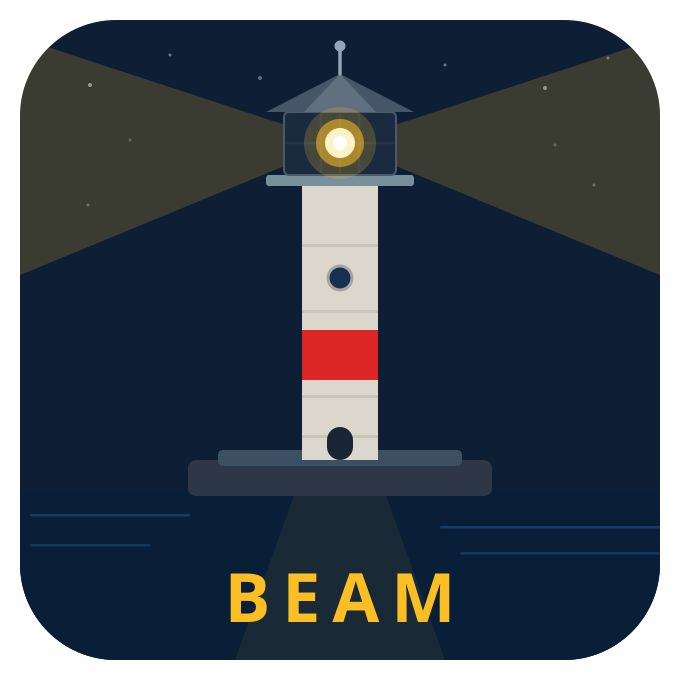
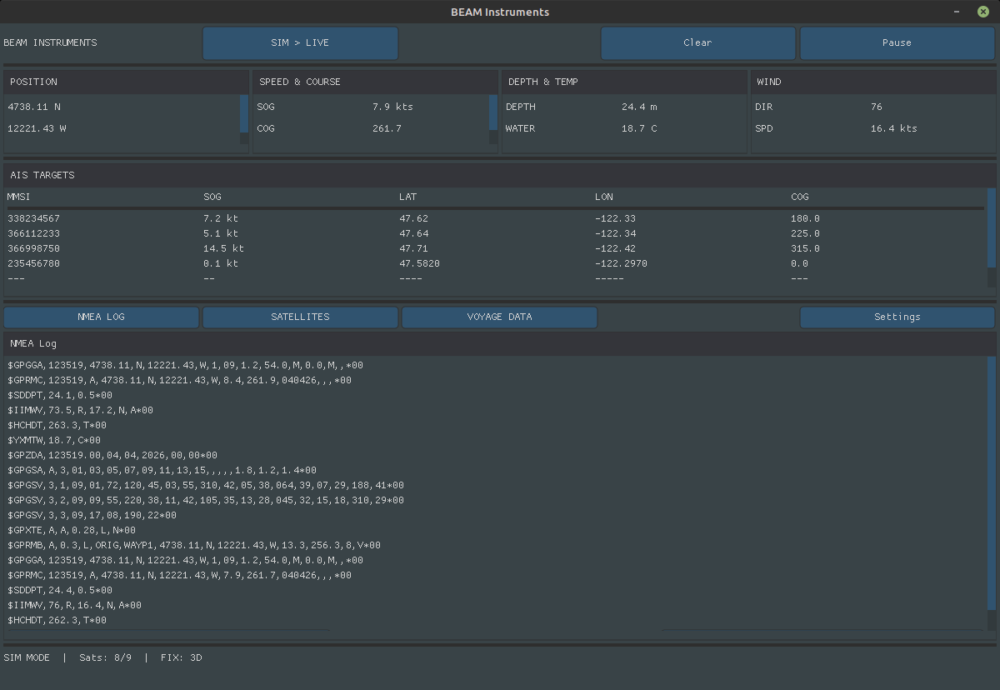

# BEAM

**BASIC Easy Application Maker**

BEAM is a cross-platform GUI application framework built on [Yabasic](https://www.yabasic.de/). It extends Yabasic with modern GUI capabilities using SDL2 and Nuklear, enabling programmers to create native desktop applications in an approachable BASIC dialect. BEAM is inspired by YAB, which extends Yabasic for application development on Haiku OS. BEAM is the fourth of 4 teaching languages developed by Fragillidae Software. The others are [STEPS](https://github.com/CFFinch62/STEPS) (verbose English-like entry language), [PLAIN](https://github.com/CFFinch62/PLAIN) (general purpose scripting language like a mix of Python and Go), and [FORGE](https://github.com/CFFinch62/FORGE) (statically typed systems programming language with easier beginner entry than C).

> *Build apps the easy way.*

---

## ✨ Features

- **BASIC syntax** — familiar, readable language accessible to beginners and experienced programmers alike
- **Cross-platform GUI** — native desktop windows via SDL2 + Nuklear immediate-mode UI
- **Rich widget set** — buttons, labels, text inputs, sliders, checkboxes, combo boxes, groups, rows, and more
- **File dialogs** — native open/save/folder dialogs via tinyfiledialogs
- **Serial I/O** — NMEA 0183 / RS-232 support for hardware and marine electronics
- **Subroutines & libraries** — modular code with `sub`/`end sub` and `import`
- **Integrated IDE** — Python/PyQt6-based development environment with syntax highlighting and nested scope coloring
- **Autotools build** — standard `./configure && make` build system
- **Yabasic compatible** — full Yabasic language support (loops, goto/gosub, arrays, strings, math, file I/O)

---

## 🚀 Quick Start

### Build

```bash
git clone https://github.com/CFFinch62/BEAM.git
cd BEAM
autoreconf --install
./configure
make
```

This produces the `beam` binary.

### Hello, BEAM!

Create `hello.bas`:

```basic
// BEAM Hello World
win = beam_open(400, 200, "Hello BEAM")

while beam_running(win)
  beam_begin(win)
    beam_label("Hello, World!")
    beam_spacing(10)
    if beam_button("Close", 80, 30) then
      beam_close(win)
    end if
  beam_end(win)
wend
```

Run it:

```bash
./beam hello.bas
```

---

## 🛠️ CLI Reference

| Command               | Description                        |
| --------------------- | ---------------------------------- |
| `beam <file.bas>`     | Run a BEAM/Yabasic program         |
| `beam --help`         | Show help                          |
| `beam --version`      | Show version                       |

---

## 📖 Language Overview

### GUI Window Lifecycle

```basic
// Open a window, run the event loop, widgets go inside begin/end
win = beam_open(640, 480, "My App")

while beam_running(win)
  beam_begin(win)
    // ... widgets here ...
  beam_end(win)
wend
```

### Widgets

```basic
// Labels and buttons
beam_label("Status: OK")
if beam_button("Click Me", 120, 36) then
  print "Button clicked!"
end if

// Text input
beam_edit("username", 200, 30)

// Checkbox
beam_checkbox("Enable logging", enabled)

// Slider
beam_slider(0, 100, volume)

// Combo box / dropdown
beam_combo("Red|Green|Blue", selected)
```

### Layout

```basic
// Row layout with fixed height and column count
beam_row(40, 3)
  beam_button("A", 80, 30)
  beam_button("B", 80, 30)
  beam_button("C", 80, 30)
beam_row_end()

// Groups for visual sections
beam_group_begin("Settings")
  beam_label("Volume:")
  beam_slider(0, 100, vol)
beam_group_end()
```

### Subroutines

```basic
sub greet(name$)
  beam_label("Hello, " + name$ + "!")
end sub
```

---

## 🧩 Editor Support

[editors/vscode](editors/vscode) is a VS Code extension for `.yab` files.

All 237 keyword forms are generated from `yabasic.flex` and split by role, so
the Yabasic core and BEAM's own additions read differently: the 37 `beam_*`
commands — widgets, dialogs and the NMEA serial calls — get their own colour.
Matching is case-insensitive, and every spelling of the block enders is handled
(`end if`, `end-if`, `endif`, `fi`, `end while`, `end switch$`).

Commands are Run (`beam <file>`), Check (`beam --check`, which parses without
executing so a GUI program opens no window) and Bind (`beam --bind`).

BEAM's split diagnostics are understood properly. It prints the location and
the message on separate lines, and only reprints the header when the file or
line changes — so a second error on the same line arrives as a bare message.
The extension keeps the last header and attaches those correctly, and drops the
trailing `Couldn't parse program` summary, which carries no location.

**File extensions:** the extension claims `.yab`, leaving `.bas` to FragBASIC —
matching how the MyCode editor resolves the same overlap. BEAM still runs
`.bas` files perfectly well; pick the language from the status bar if you have
some.

---

## 🖥️ IDE Features

### Nested Scope Coloring

The integrated IDE (`beam_ide/`) paints nested, colored backgrounds
behind each block of code — similar to BlueJ — so you can see where an
`if`, `for`, `while`, `do`, `repeat`, `switch`, or `sub` body starts and
ends just by looking at the background. Since BEAM is Yabasic and not
indentation-significant, the IDE detects blocks by matching each
opening keyword to its closing keyword (`if`/`end if`, `for`/`next`,
`while`/`wend`, `do`/`loop`, `repeat`/`until`, `switch`/`end switch`,
`sub`/`end sub`) rather than by tracking indentation. Each level of
nesting gets its own color, drawn behind the syntax-highlighted text,
and recomputes automatically a moment after you stop typing.

**To toggle it on or off:**

- **View** menu → **Show Nested Scope Coloring**, or
- **Settings → Preferences** (`Ctrl+,`) → **Editor** tab → **"Show nested scope boxes"**

Both controls stay in sync with each other.

**To customize the colors:**

1. Open **Settings → Preferences** (`Ctrl+,`) → **Editor** tab
2. Under **Nested Scope Coloring**, click a depth's color swatch to open a color picker and choose a custom color for that nesting level
3. Click **Reset to Theme Defaults** at any time to go back to the colors defined by your current UI theme

If you never customize the colors, they automatically follow whichever UI theme you have selected (**View → Theme → UI Theme**), so switching themes keeps the scope colors looking coherent with the rest of the IDE.

---

## 📁 Project Structure

```
Beam/
├── main.c                # Yabasic interpreter core
├── beam_src/             # BEAM extension source
│   ├── beam_gui.c/h      # SDL2 + Nuklear GUI system
│   ├── beam_commands.c/h  # BEAM command implementations
│   └── beam_nmea.c/h     # NMEA 0183 serial parser
├── beam_ide/             # Integrated IDE (Python/PyQt6)
├── examples/             # Example BEAM programs
│   ├── hello.bas         # Hello World
│   ├── calculator.bas    # 4-function calculator
│   ├── todo.bas          # To-do list app
│   ├── color_picker.bas  # Color picker
│   ├── beam-instruments.bas  # NMEA 0183 marine instruments
│   └── ...
├── docs/                 # Documentation
│   ├── BEAM_Language_Reference.md
│   └── BEAM_Implementation_Spec.md
├── tests/                # Yabasic test suite
├── configure.ac          # Autotools configuration
├── Makefile.am           # Automake input
└── LICENSE               # MIT License
```

---

## 📚 Documentation

| Document | Description |
| -------- | ----------- |
| [BEAM Language Reference](docs/BEAM_Language_Reference.md) | Complete BEAM API and widget reference |
| [BEAM Implementation Spec](docs/BEAM_Implementation_Spec.md) | Architecture and implementation details |
| [Yabasic Manual](https://www.yabasic.de/) | Core Yabasic language documentation |

---

## 🚢 Real-World Example Applications

BEAM includes example applications that demonstrate real-world capability beyond teaching exercises. The NMEA 0183 Marine Instruments app parses live serial data from marine electronics and displays navigation instruments including compass heading, GPS position, speed, and wind data.



---

## 📦 Dependencies

- **GCC** (C99) or Clang
- **SDL2** (`libsdl2-dev`)
- **X11** (standard on Linux)
- **ncurses** (`libncurses-dev`)
- **libffi** (`libffi-dev`) — optional, for foreign function calls
- **Autotools** (`autoconf`, `automake`, `libtool`) — for building from source

---

## 🧪 Running Tests

```bash
make check
```

---

## 📄 License

BEAM is released under the [MIT License](LICENSE).

---

<sub>© 2026 Fragillidae Software · Based on Yabasic by Marc Ihm</sub>
